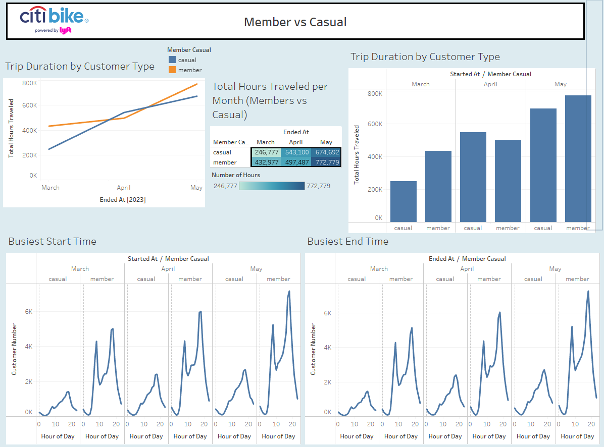
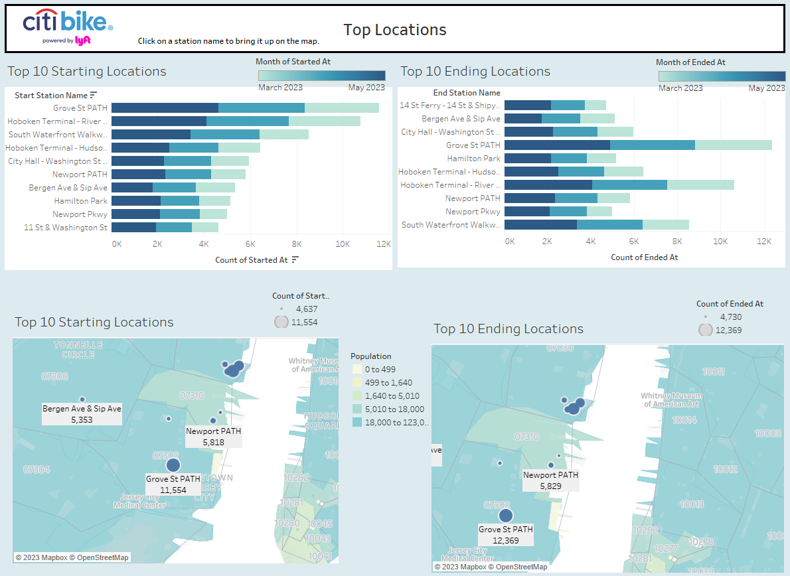

# Citi Bike Data Analysis

This project aims to analyze Citi Bike data to gain insights into user behavior and travel patterns. The information used in this analysis was gathered from the Citi Bikes website. The primary objectives of this analysis are:

Determine the average duration of travel by user type.
Investigate if there is a difference between member and casual users regarding the time they use the service.
Identify the top locations traveled to and started from by Citi Bike users.

## Tableau Story
To visualize and explore the findings, a Tableau story has been created. The Tableau story presents interactive visualizations and insights derived from the Citi Bike data.

Please access the Tableau story page [Here](https://public.tableau.com/app/profile/joshua.aldridge/viz/CitiBike_16888655277100/CitiBikeStory).

## Analysis Overview
#### Average Duration of Travel by User Type
One of the main objectives of this analysis is to determine the average duration of travel by user type. By comparing member and casual users, we can gain insights into how usage patterns differ between these two groups.

#### Usage Patterns by Time of Day
This analysis also aims to investigate if there is a difference between member and casual users in terms of the time they use the Citi Bike service. By examining usage patterns throughout the day, we can identify any variations in behavior between the two user types.

#### Top Locations Traveled To/ Started From
Understanding the most frequently traveled locations is crucial for identifying popular destinations and potential areas for infrastructure improvements. By analyzing the data, we can identify the top locations traveled to by Citi Bike users and gain insights into popular destinations within the service area.

#### Getting Started
To access the Tableau story and explore the findings, please click on the link provided above. The Tableau story page will open, allowing you to interact with the visualizations and explore the data-driven insights.

Data Source
The data used for this analysis was obtained from the Citi Bikes website at [Citi Bike Data Source](https://citibikenyc.com/system-data). The dataset provides information about user types, trip durations, timestamps, and other relevant attributes necessary for the analysis.

